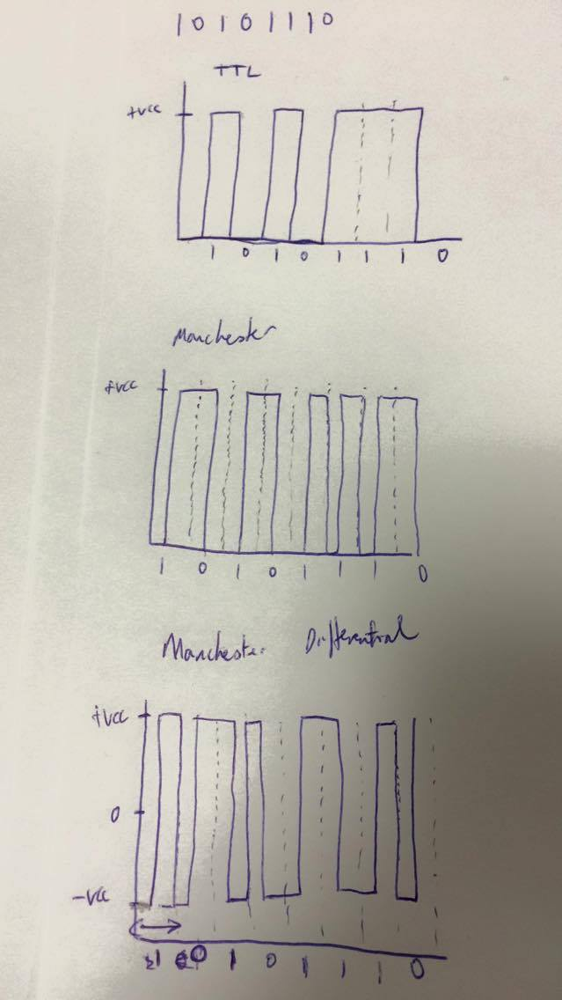

### 1

### a i) 

ICMP - allows routers to send control/error messages to other routers/hosts and provide feedback about communication problems (e.g. no guarantee of delivery, control message return) 

For general knowledge of different internet protocols:

- ICMP
  - Internet Control Message Protocol - messages which generally contain information about routing difficulties with IP datagrams or simple exchanges such as time-stamp or echo transactions.

- Dynamic Host Configuration Protocol 
  - provides Internet hosts with configuration parameters. DHCP is an extension of BOOTP. DHCP consists of two components: a protocol for delivering host-specific configuration parameters from a DHCP server to a host and a mechanism for allocation of network addresses to hosts. 

- Address Resolution Protocol / Reverse Address Resolution Protocol 
  - to initialize the use of Internet addressing on an Ethernet or other network that uses its own media access control (MAC). ARP allows a host to communicate with other hosts when only the Internet address of its neighbors is known. Before using IP, the host sends a broadcast ARP request containing the Internet address of the desired destination system. 

ICMP relates to the Network Layer of the OSI Model.

### a ii)

Frame delimiter - indicate start/end of frame (protocol data unit of the data link layer). Comes after the preamble in the ethernet packet. 

Preamble: establish synchronization

### a iii)

Simple Mail Transfer Protocol (SMTP) is a protocal used by Mail Transfer Agents (e.g. Exchange) and Mail User Agents (Outlook, Thunderbird) for delivering mail from one system to another.

two parties communicate using TCP and port 25.

SMTP relates to the application layer.

#### a iv)

Think of a routing table like a map for each little router so it can figure out where in the world he is. 

In computer networking a routing table is a data table stored in a router or a networked computer that lists the routes to particular network destinations, and in some cases, metrics (distances) associated with those routes. The routing table contains information about the topology of the network immediately around it.

Routing tables refer to the network layer.

---

### b i) 

Medium Access Control - Sublayer of the data link layer. I

Network links can be divided into two categories: those using point-to-point connections and those using broadcast channels. In any broadcast network, the key issue is how to determine who gets to use the channel when there is competition for it.

The protocols used to determine who goes next on a multiaccess channel belong to a sublayer of the data link layer called the MAC (Medium Access Control) sublayer. 

### b ii)

CSMA/CD is a set of rules determining how network devices respond when two devices attempt to use a data channel simultaneously (called a collision). 

Standard Ethernet networks use CSMA/CD to physically monitor the traffic on the line at participating stations. If no transmission is taking place at the time, the particular station can transmit. If two stations attempt to transmit simultaneously, this causes a collision, which is detected by all participating stations. After a random time interval, the stations that collided attempt to transmit again. 

If another collision occurs, the time intervals from which the random waiting time is selected are increased step by step. This is known as exponential back off.

### b iii)

need to come back to this.

### b iv)

You can connect multiple hosts in a LAN using a switch.

Note: a bridge is the same thing as a switch but can only connect two hosts. 

---

### 2 a i)

Circuit switched networks are essentially a maintained path (think telephones). Packet Switched Networks are an out of order transfer system (think sending letters).

CS networks only incur costs at the set up connection while PS networks are charged with each packet.

CS networks provide guaranteed resources (just like a phone call) whereas resources may not be guaranteed. 

A CS network route breaks if any link or switch on the route fails. PS networks are more robust because failures are accomodated transparently when packets get lost (i.e. you know when a PS network starts to fuck up and it won't result in a catastrophic failure). 

### a ii)

Circuit switched networks are more suitable for live video streaming because you need guaranteed resources. In addition, information cannot be sent out of order otherwise the video would not functoin properly.

Another reason is that a CS network will not have congestion once the initial set up is created.

###  a iii)

CL vs CO. 

Connectionless services do not maintain a connection or a specific routes. Datagrams (packets) are addressed by destination and are handle separately (again, think letters). Connectionless services are maintained using packet switching. 

Connection Oriented services maintain a connection between endpoints in the form of a circuit. Cicruit switched networks provide a pure CO service. PS networks, on the other hand, provide a CO service by creating virtual circuits.

### a iv)

a CL service cannot be provided on a Circuit Switched Network because the unit of transfer in a CL network is a datagram. This is not possible in a CS network. 

### 2 bi)

---

### 3 a)

