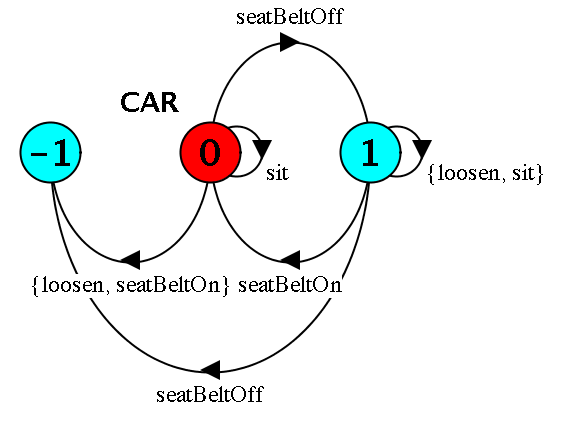

# Section A
### 1

a)

When you execute something synchronously, you wait for it to finish before moving on to another task. When you execute something asynchronously, you can move on to another task before it finishes.

Synchronous (one thread):
```
1 thread ->   |----A-----||-----B-----------||-------C------|
```
Synchronous (multi-threaded):
```
thread A -> |----A-----|   
                        \  
thread B ------------>   ->|-----B-----------|   
                                              \   
thread C ---------------------------------->   ->|-------C------| 
```
Asynchronous (one thread):
```

         A-Start ---------------------------------------- A-End   
           | B-Start ----------------------------------------|--- B-End   
           |   |     C-Start -------------------- C-End      |     |   
           V   V       V                           V         V     V      
1 thread-> |-A-|---B---|-C-|-A-|-C-|--A--|-B-|--C--|---A-----|--B--| 
```
Asynchronous (multi-Threaded):
```

 thread A ->     |----A-----|
 thread B ----->     |-----B-----------| 
 thread C --------->     |-------C----------
 ```
 http://stackoverflow.com/questions/748175/asynchronous-vs-synchronous-execution-what-does-it-really-mean
 
 bi)
 
 ```
const N = 4
range T = 0..N

CYCLE = CYCLE[0],
CYCLE[v:T] = (when(v<N)in[v] ->CYCLE[v+1]
			 |when(v==N)in[v] -> CYCLE[0]).

 ```
 
 bii)
 
 *To be improved*
 ```
 BUFF = (in[i:0..3]-> (when (i ==2) win -> STOP
                     |when(i!=2) ran[i] -> STOP)).

 ```
 
 biii)
 
 *to add*
 
 
 c)
 
 
 
 
