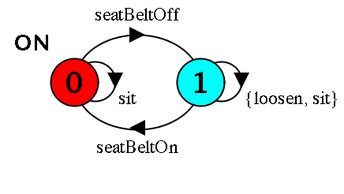
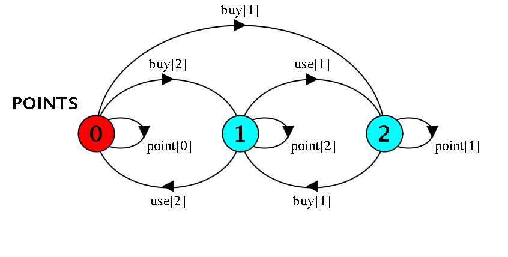
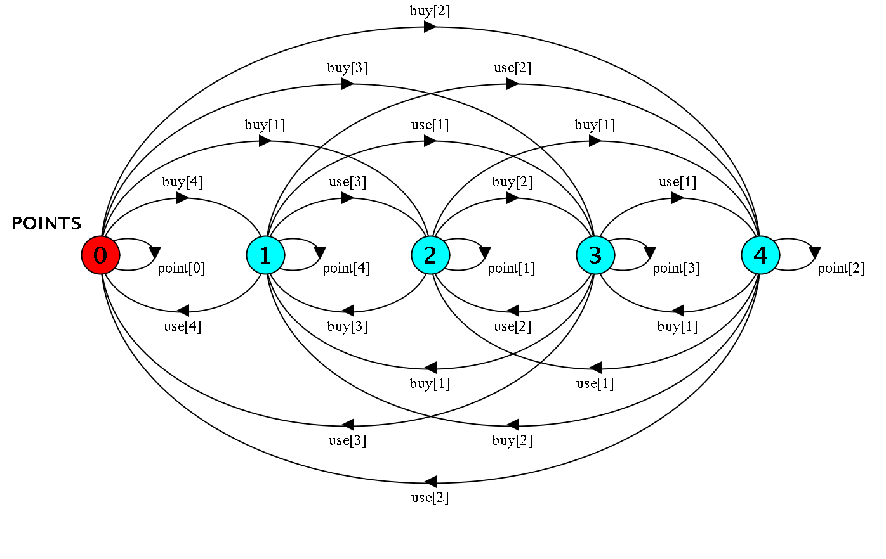

# Section A
### 1

a)

By asynchronous we mean that processes proceed at arbitrary relative speeds and consequently their actions can be arbitrarily interleaved.

-- Extended answer (just for general knowledge):

When you execute something synchronously, you wait for it to finish before moving on to another task. When you execute something asynchronously, you can move on to another task before it finishes.

Synchronous (one thread):
```
1 thread ->   |----A-----||-----B-----------||-------C------|
```
Synchronous (multi-threaded):
```
thread A -> |----A-----|   
                        \  
thread B ------------>   ->|-----B-----------|   
                                              \   
thread C ---------------------------------->   ->|-------C------| 
```
Asynchronous (one thread):
```

         A-Start ---------------------------------------- A-End   
           | B-Start ----------------------------------------|--- B-End   
           |   |     C-Start -------------------- C-End      |     |   
           V   V       V                           V         V     V      
1 thread-> |-A-|---B---|-C-|-A-|-C-|--A--|-B-|--C--|---A-----|--B--| 
```
Asynchronous (multi-Threaded):
```

 thread A ->     |----A-----|
 thread B ----->     |-----B-----------| 
 thread C --------->     |-------C----------
 ```
 http://stackoverflow.com/questions/748175/asynchronous-vs-synchronous-execution-what-does-it-really-mean
 
 bi)
 
 ```
const N = 4
range T = 0..N

CYCLE = CYCLE[0],
CYCLE[v:T] = (when(v<N)in[v] ->CYCLE[v+1]
			 |when(v==N)in[v] -> CYCLE[0]).

 ```
 
 bii)
 ```
CARD = (count[i:1..5] -> COUNT[i]),
COUNT[i:1..5] = (when i==2 win -> STOP).
 ```
 
 biii)
 ```
TEA = PACKS[3],
PACKS[i:0..3] = (when i > 1 double_packs -> PACKS[i-2]
				|when i > 0 pack -> PACKS[i-1]
				|when i == 0 buy -> PACKS[3]
				|packs[i] -> PACKS[i]).
 ```
 
 c)
 
 
 
 
 
### 2

a)

bi)

bii)

Let's start with just const MAX = 2 to make things a bit more manageable:
```
const MAX = 2
POINTS = POINTS[0],
POINTS[i:0 .. MAX] = 
	( when (i< MAX) buy[j:1..MAX-i] -> POINTS[j+i]
	| when (i>1) use[j:1..i] -> POINTS[i-j]
	| point[i] -> POINTS[i]).

```

 
 
 Now for the granddaddy LTS:
 
 
 

ci)

Process sharing ({a1,a2,...,an}::P):

{a1,a2,...,an}::P could be modelled as a:P and b:P but that would mean that they would be two distinct 
actions where in fact they are the same, so we have to use the notation: {a1,a2,...,an}::P

Process labellign (a:P)

a:P prefixes each action label in the alphabet of P with a

cii)

*still needs work*
```
const MAX = 2
VAR = VAR[0],
VAR[i:0..MAX] = (read[i] -> VAR[i] 
				|write[j:0..MAX] -> VAR[j]).

THREAD(N=1) = (write[N]->read[i:0..MAX]->STOP)+{write[i:0..MAX]}.

||PARALLEL = (VAR||THREAD)
```


